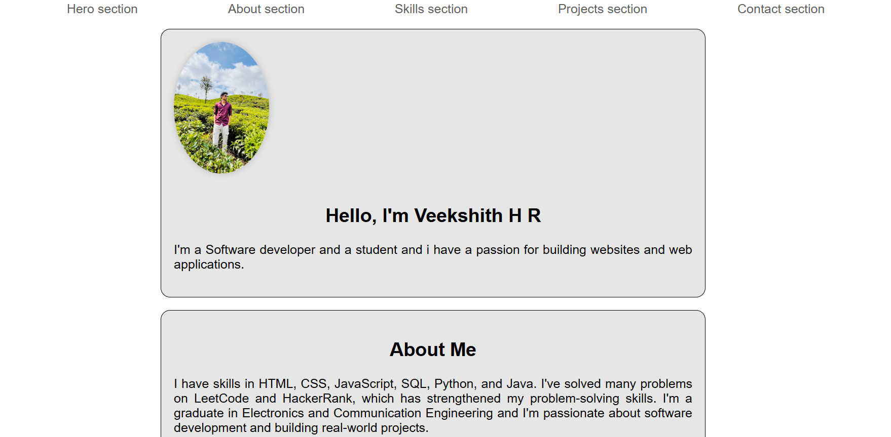

# Developer Landing Page 🚀

A clean, modern, and responsive developer landing page to showcase your personal brand and portfolio.

## 🌐 Live Demo
Check it out live here:  
🔗 [https://hrveekshith.github.io/developer-landing-page/](https://hrveekshith.github.io/developer-landing-page/)

---

## 📌 Features

- Responsive design for all devices
- Clean and minimal layout
- Modern typography and visual style
- Social media integration
- Easy to customize for personal branding

---

## 🛠️ Built With

- HTML5
- CSS3
- Google Fonts

---

## 📁 Folder Structure

developer-landing-page/
│
├── assets/
│ └── preview.png
├── index.html
├── style.css
└── README.md

yaml
Copy
Edit

---

## 🧑‍💻 Author

**Veekshith H R**  
📫 [GitHub Profile](https://github.com/hrveekshith)

---

## 🙌 Acknowledgements

- Design inspiration from various developer portfolios on GitHub and Dribbble.

---

## 📜 License

This project is open-source and available under the [MIT License](LICENSE)
